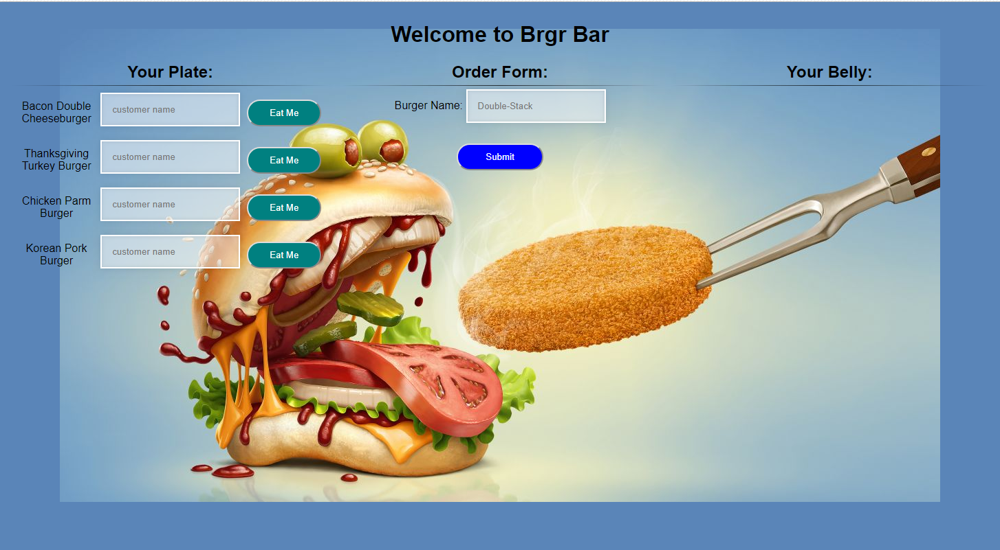

# Brgr Bar
### Now featuring Sequelize

This is a revamp of [Brgr Bar](https://github.com/mikebly/burger), with the home-brew ORM
replaced with Sequlize.

Created with the Sequlize CLI, Express, and Handlebars

### Features
The Burger Bar has three main sections, each with different database queries associated with them
1. Order Form - Here you can add a new burger to the "Plate", via a POST request to add database entries
2. Your Plate - Here, you are able to add a a customer name to a burger and set its state to eaten, via a PUT request to update database entries.
3. Your Belly - Here, eaten burgers can be deleted from the database via a DELETE request (also known as composting)

